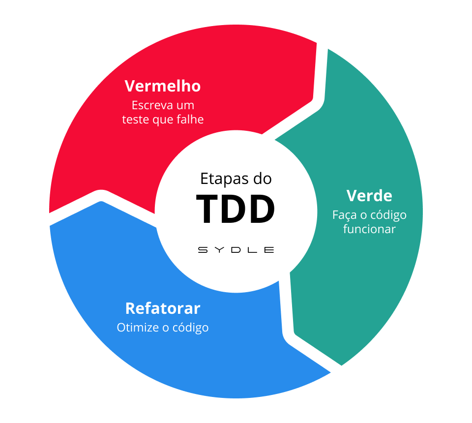

<p align="center">
  
</p>

---

**Autores:** Danillo | Giulianna | Matheus | Victor

---

# Guia do Ciclo TDD - Integração de CPF, Cargo e Senha

<!--
README.md

Documentação detalhada do projeto de integração de CPF, cargo e senha.
Explica o ciclo TDD, as etapas do desenvolvimento, a estrutura dos arquivos e como compilar e rodar o sistema.
Serve como guia para apresentação e entendimento do projeto.
-->

Este documento explica o passo a passo do desenvolvimento do sistema integrado de usuário (CPF, cargo e senha) utilizando a metodologia **TDD (Test Driven Development)** e a abordagem em espiral.

O TDD segue o ciclo **Red-Green-Refactor**:

1. **Red**: Escreva um teste que falha (antes de ter a funcionalidade).
2. **Green**: Escreva o código mínimo para fazer o teste passar.
3. **Refactor**: Melhore o código sem quebrar os testes.

Aqui, cada ciclo da espiral incrementa uma funcionalidade: CPF, cargo, senha e integração.

---

## Estrutura dos Arquivos

- `user.c`/`user.h`: Implementação das funções de usuário (validação de CPF, senha, cargo, criação e deleção).
- `test_user.c`: Testes integrados cobrindo todos os requisitos.
- `main.c`: Exemplo de uso do sistema.

---

## 1. Validação de CPF

**Função:** `validate_cpf` (em `user.c`)

- **Red:** Escrevemos testes em `test_user.c` para CPFs inválidos e válidos. Inicialmente, a função retorna sempre falso.
- **Green:** Implementamos a lógica básica: verifica se o CPF tem 11 dígitos numéricos.
- **Refactor:** Melhoramos nomes, tipos e comentários, mantendo a lógica clara e robusta.
- **Resultado:** Os testes de CPF passam, garantindo que só CPFs válidos são aceitos.

## 2. Validação de Cargo

**Função:** `validate_cargo` (em `user.c`)

- **Red:** Testes em `test_user.c` para cargos aceitos e rejeitados. Inicialmente, a função retorna sempre falso.
- **Green:** Implementamos a verificação se o cargo está na lista de permitidos ("professor", "ceo", "gerente").
- **Refactor:** Refino da lista de cargos e clareza do código.
- **Resultado:** Apenas cargos válidos são aceitos, conforme os testes.

## 3. Validação de Senha

**Função:** `validate_password` (em `user.c`)

- **Red:** Testes para cada regra (tamanho, maiúscula, minúscula, especial, dígito) em `test_user.c`, todos falhando inicialmente.
- **Green:** Implementação das regras, uma a uma, até todos os testes passarem.
- **Refactor:** Uso de `bool`, nomes claros e comentários.
- **Resultado:** Apenas senhas que cumprem todos os requisitos são aceitas.

## 4. Integração e Criação de Usuário

**Função:** `create_user` (em `user.c`)

- **Red:** Teste integrado em `test_user.c` para criar usuário só com dados válidos.
- **Green:** Implementação da função que só cria usuário se CPF, senha e cargo forem válidos.
- **Refactor:** Clareza na alocação e liberação de memória, documentação.
- **Resultado:** O sistema só permite criar usuários válidos, e todos os testes integrados passam.

---

## Etapas do TDD Separadas (Red-Green-Refactor)

Para cada funcionalidade (CPF, senha, cargo), há uma subpasta em `etapas_tdd/` com arquivos separados para cada etapa do ciclo TDD:

- **Red:** Teste inicial que falha (ou nem compila), mostrando o início do ciclo.
- **Green:** Implementação mínima para passar o teste básico.
- **Refactor:** Implementação final, comentada e com testes completos.

### Como visualizar o progresso do TDD

1. Entre na pasta da etapa desejada, por exemplo:
   ```bash
   cd etapas_tdd/cpf
   ```
2. Compile e execute cada etapa:
   - **Red:**
     ```bash
     gcc -o test_cpf_red test_cpf_red.c validate_cpf_red.c && ./test_cpf_red
     ```
     (Deve falhar ou nem compilar)
   - **Green:**
     ```bash
     gcc -o test_cpf_green test_cpf_green.c validate_cpf_green.c && ./test_cpf_green
     ```
     (Deve passar apenas o teste básico)
   - **Refactor:**
     ```bash
     gcc -o test_cpf_refactor test_cpf_refactor.c validate_cpf_refactor.c && ./test_cpf_refactor
     ```
     (Todos os testes passam, código comentado)

Repita o mesmo para as pastas `senha` e `cargo`.

### O que observar nos logs
- O log de cada execução mostra claramente o ciclo Red-Green-Refactor.
- Cada arquivo está comentado linha a linha para facilitar a compreensão do progresso.
- Assim, a professora pode ver a evolução do código e dos testes em cada etapa do TDD.

---

## Resumo dos Testes Automatizados

Os testes automatizados cobrem todos os requisitos de negócio e garantem a robustez do sistema. Veja abaixo o que é testado:

### Validação de CPF

- Aceita: 11 dígitos numéricos (ex: "12345678901")
- Rejeita: Menos de 11 dígitos, caracteres não numéricos (ex: "abcdefghijk", "123")

### Validação de Cargo

- Aceita: Qualquer valor não vazio, até 24 caracteres, apenas letras (maiúsculas/minúsculas), espaço e hífen
  - Exemplos válidos: "professor", "CEO", "Supervisor de Area", "Gerente-Adjunto", "aluno"
- Rejeita: Vazio, NULL, mais de 24 caracteres, números, caracteres especiais
  - Exemplos inválidos: "", NULL, "xxxxxxxxxxxxxxxxxxxxxxxxx" (25+), "Gerente123", "Gerente!"

### Validação de Senha

- Aceita: Mínimo 8 caracteres, pelo menos uma maiúscula, uma minúscula, um dígito e um caractere especial
  - Exemplo válido: "Senha@123"
- Rejeita: Ausência de qualquer requisito acima
  - Exemplos inválidos: "senha@123" (sem maiúscula), "SENHA@123" (sem minúscula), "Senha1234" (sem especial), "Senha@abc" (sem dígito), "S@1a" (curta)

### Criação de Usuário

- Só é possível criar usuário se CPF, senha e cargo forem todos válidos
- Testes garantem que combinações inválidas são rejeitadas

---

## Como compilar e rodar

```bash
gcc -o main main.c user.c
./main

gcc -o test_user test_user.c user.c
./test_user
```

---

## Observações

- O código demonstra a evolução e integração dos módulos, seguindo TDD e espiral.
- Os testes em `test_user.c` mostram logs detalhados de cada etapa.
- O README detalha as decisões e etapas do desenvolvimento para facilitar a compreensão e apresentação.
- **Todos os testes podem ser executados rodando:**
  ```bash
  gcc -o test_user test_user.c user.c
  ./test_user
  ```
  O resultado exibirá quais casos passaram e quais regras estão sendo validadas.
